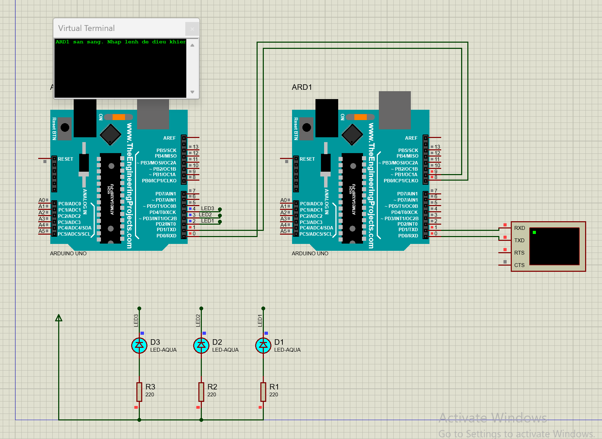
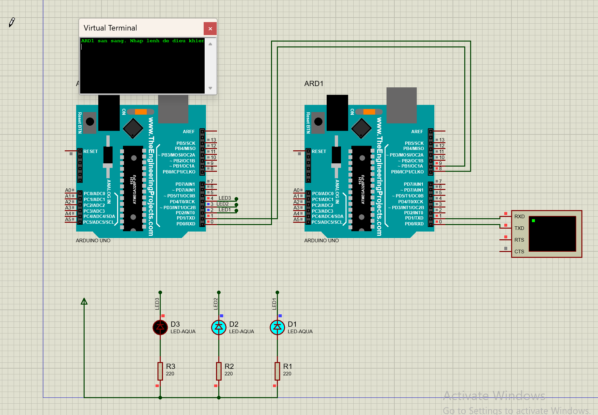
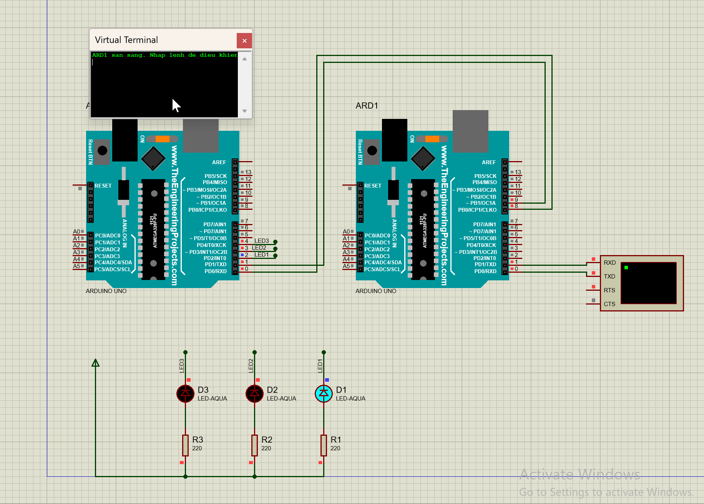
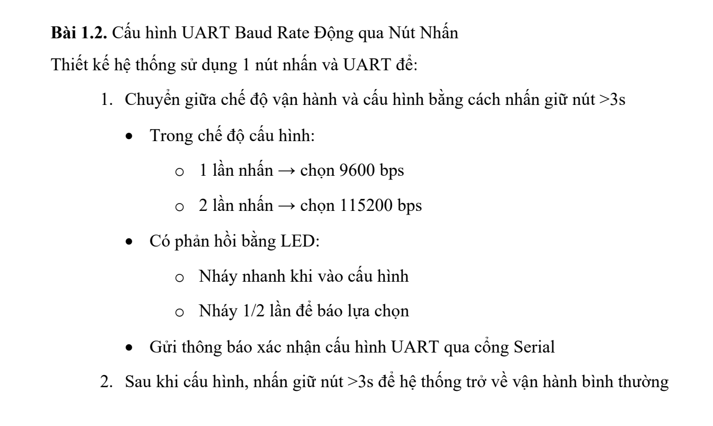

# TruyenthongIoT

## Bài 1.1. Giao tiếp UART giữa Arduino và module ESP8266

Dự án mô phỏng giao tiếp UART giữa Arduino và module ESP8266 trên Proteus.

## Nội dung

- `New Project.pdsprj`: file mô phỏng Proteus.
- `code/adr1/adr1.ino`: chương trình Arduino thứ nhất.
- `code/adr2/adr2.ino`: chương trình Arduino thứ hai.
- `code/adr1/build/arduino.avr.uno/adr1.ino.hex`: file HEX dùng cho Proteus.
- `code/adr2/build/arduino.avr.uno/adr2.ino.hex`: file HEX dùng cho Proteus.
- `images/`: ảnh chụp kết quả mô phỏng.

## Hình ảnh mô phỏng

## Bài 1.2. Cấu hình UART Baud Rate Động qua Nút Nhấn

Thiết kế hệ thống sử dụng 1 nút nhấn và UART để chuyển giữa chế độ vận hành và cấu hình baud rate.

### Nội dung

- `1.2/proteus/New Project.pdsprj`: file mô phỏng Proteus.
- `1.2/code/bai1_2_baudrate/bai1_2_baudrate.ino`: code Arduino.
- `1.2/code/bai1_2_baudrate/build/arduino.avr.uno/bai1_2_baudrate.ino.hex`: file HEX dùng cho Proteus.
- `1.2/images/bai_1_2_de_bai.png`: ảnh đề bài.

### Đề bài

